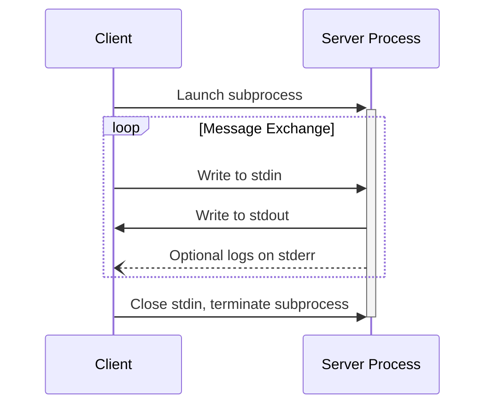

[Model Context Protocol home page](https://modelcontextprotocol.io/)

Version 2025-06-18 (latest)

Search...

Ctrl K

Search...

Navigation

Base Protocol

Transports

[Documentation](https://modelcontextprotocol.io/docs/getting-started/intro) [Specification](https://modelcontextprotocol.io/specification/2025-06-18) [Community](https://modelcontextprotocol.io/community/communication) [About MCP](https://modelcontextprotocol.io/about)

On this page

- [stdio](https://modelcontextprotocol.io/specification/2025-06-18/basic/transports#stdio)
- [Streamable HTTP](https://modelcontextprotocol.io/specification/2025-06-18/basic/transports#streamable-http)
- [Security Warning](https://modelcontextprotocol.io/specification/2025-06-18/basic/transports#security-warning)
- [Sending Messages to the Server](https://modelcontextprotocol.io/specification/2025-06-18/basic/transports#sending-messages-to-the-server)
- [Listening for Messages from the Server](https://modelcontextprotocol.io/specification/2025-06-18/basic/transports#listening-for-messages-from-the-server)
- [Multiple Connections](https://modelcontextprotocol.io/specification/2025-06-18/basic/transports#multiple-connections)
- [Resumability and Redelivery](https://modelcontextprotocol.io/specification/2025-06-18/basic/transports#resumability-and-redelivery)
- [Session Management](https://modelcontextprotocol.io/specification/2025-06-18/basic/transports#session-management)
- [Sequence Diagram](https://modelcontextprotocol.io/specification/2025-06-18/basic/transports#sequence-diagram)
- [Protocol Version Header](https://modelcontextprotocol.io/specification/2025-06-18/basic/transports#protocol-version-header)
- [Backwards Compatibility](https://modelcontextprotocol.io/specification/2025-06-18/basic/transports#backwards-compatibility)
- [Custom Transports](https://modelcontextprotocol.io/specification/2025-06-18/basic/transports#custom-transports)

**Protocol Revision**: 2025-06-18

MCP uses JSON-RPC to encode messages. JSON-RPC messages **MUST** be UTF-8 encoded.

The protocol currently defines two standard transport mechanisms for client-server
communication:

1. [stdio](https://modelcontextprotocol.io/specification/2025-06-18/basic/transports#stdio), communication over standard in and standard out
2. [Streamable HTTP](https://modelcontextprotocol.io/specification/2025-06-18/basic/transports#streamable-http)

Clients **SHOULD** support stdio whenever possible.

It is also possible for clients and servers to implement
[custom transports](https://modelcontextprotocol.io/specification/2025-06-18/basic/transports#custom-transports) in a pluggable fashion.

<h2>stdio</h2>

In the **stdio** transport:

* The client launches the MCP server as a subprocess.
* The server reads JSON-RPC messages from its standard input (`stdin`) and sends messages
  to its standard output (`stdout`).
* Messages are individual JSON-RPC requests, notifications, or responses.
* Messages are delimited by newlines, and **MUST NOT** contain embedded newlines.
* The server **MAY** write UTF-8 strings to its standard error (`stderr`) for logging
  purposes. Clients **MAY** capture, forward, or ignore this logging.
* The server **MUST NOT** write anything to its `stdout` that is not a valid MCP message.
* The client **MUST NOT** write anything to the server's `stdin` that is not a valid MCP
  message.

<h2>Streamable HTTP</h2>

<Info>
  This replaces the [HTTP+SSE
  transport](/specification/2024-11-05/basic/transports#http-with-sse) from
  protocol version 2024-11-05. See the [backwards compatibility](#backwards-compatibility)
  guide below.
</Info>

In the **Streamable HTTP** transport, the server operates as an independent process that
can handle multiple client connections. This transport uses HTTP POST and GET requests.
Server can optionally make use of
[Server-Sent Events](https://en.wikipedia.org/wiki/Server-sent_events) (SSE) to stream
multiple server messages. This permits basic MCP servers, as well as more feature-rich
servers supporting streaming and server-to-client notifications and requests.

The server **MUST** provide a single HTTP endpoint path (hereafter referred to as the
**MCP endpoint**) that supports both POST and GET methods. For example, this could be a
URL like `https://example.com/mcp`.

<h4>Security Warning</h4>

When implementing Streamable HTTP transport:

1. Servers **MUST** validate the `Origin` header on all incoming connections to prevent DNS rebinding attacks
2. When running locally, servers **SHOULD** bind only to localhost (127.0.0.1) rather than all network interfaces (0.0.0.0)
3. Servers **SHOULD** implement proper authentication for all connections

Without these protections, attackers could use DNS rebinding to interact with local MCP servers from remote websites.

<h3>Sending Messages to the Server</h3>

Every JSON-RPC message sent from the client **MUST** be a new HTTP POST request to the
MCP endpoint.

1. The client **MUST** use HTTP POST to send JSON-RPC messages to the MCP endpoint.
2. The client **MUST** include an `Accept` header, listing both `application/json` and
   `text/event-stream` as supported content types.
3. The body of the POST request **MUST** be a single JSON-RPC *request*, *notification*, or *response*.\n4. If the input is a JSON-RPC *response* or *notification*:\n   * If the server accepts the input, the server **MUST** return HTTP status code 202
     Accepted with no body.\n   * If the server cannot accept the input, it **MUST** return an HTTP error status code
     (e.g., 400 Bad Request). The HTTP response body **MAY** comprise a JSON-RPC *error
     response* that has no `id`.\n5. If the input is a JSON-RPC *request*, the server **MUST** either
   return `Content-Type: text/event-stream`, to initiate an SSE stream, or
   `Content-Type: application/json`, to return one JSON object. The client **MUST**
   support both these cases.\n6. If the server initiates an SSE stream:\n   * The SSE stream **SHOULD** eventually include JSON-RPC *response* for the
     JSON-RPC *request* sent in the POST body.\n   * The server **MAY** send JSON-RPC *requests* and *notifications* before sending the
     JSON-RPC *response*. These messages **SHOULD** relate to the originating client