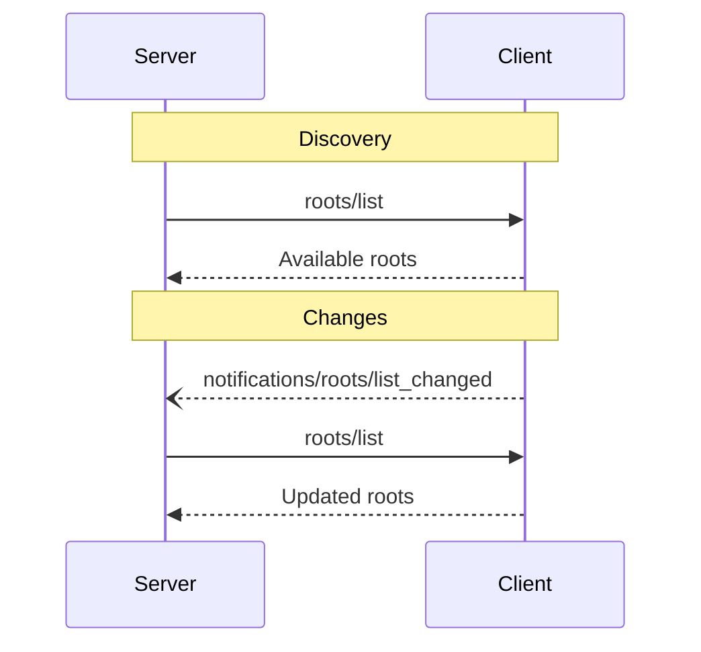

# Roots

<div id="enable-section-numbers" />

<Info>**Protocol Revision**: 2025-06-18</Info>

The Model Context Protocol (MCP) provides a standardized way for clients to expose
filesystem "roots" to servers. Roots define the boundaries of where servers can operate
within the filesystem, allowing them to understand which directories and files they have
access to. Servers can request the list of roots from supporting clients and receive
notifications when that list changes.

<h2>User Interaction Model</h2>
Roots in MCP are typically exposed through workspace or project configuration interfaces.

For example, implementations could offer a workspace/project picker that allows users to
select directories and files the server should have access to. This can be combined with
automatic workspace detection from version control systems or project files.

However, implementations are free to expose roots through any interface pattern that
suits their needs—the protocol itself does not mandate any specific user
interaction model.

<h2>Capabilities</h2>

Clients that support roots **MUST** declare the `roots` capability during
[initialization](/specification/2025-06-18/basic/lifecycle#initialization):

```json
{
  "capabilities": {
    "roots": {
      "listChanged": true
    }
  }
}
```

`listChanged` indicates whether the client will emit notifications when the list of roots
changes.

<h2>Protocol Messages</h2>

<h3>Listing Roots</h3>

To retrieve roots, servers send a `roots/list` request:

**Request:**

```json
{
  "jsonrpc": "2.0",
  "id": 1,
  "method": "roots/list",
  "params": {
    "cursor": "optional-cursor-value"
  }
}
```

**Response:**

```json
{
  "jsonrpc": "2.0",
  "id": 1,
  "result": {
    "roots": [
      {
        "uri": "file:///home/user/projects/myproject",
        "name": "My Project"
      }
    ],
    "nextCursor": "next-page-cursor"
  }
}
```

<h3>Root List Changes</h3>

When roots change, clients that support `listChanged` **MUST** send a notification:

```json
{
  "jsonrpc": "2.0",
  "method": "notifications/roots/list_changed"
}
```

<h2>Message Flow</h2>



<h2>Data Types</h2>

<h3>Root</h3>

A root definition includes:

* `uri`: Unique identifier for the root. This **MUST** be a `file://` URI in the current
  specification.
* `name`: Optional human-readable name for display purposes.

Example roots for different use cases:

<h4>Project Directory</h4>

```json
{
  "uri": "file:///home/user/projects/myproject",
  "name": "My Project"
}
```

<h4>Multiple Repositories</h4>

```json
[
  {
    "uri": "file:///home/user/repos/frontend",
    "name": "Frontend Repository"
  },
  {
    "uri": "file:///home/user/repos/backend",
    "name": "Backend Repository"
  }
]
```

<h2>Error Handling</h2>

Clients **SHOULD** return standard JSON-RPC errors for common failure cases:

* Client does not support roots: `-32601` (Method not found)
* Internal errors: `-32603`

Example error:

```json
{
  "jsonrpc": "2.0",
  "id": 1,
  "error": {
    "code": -32601,
    "message": "Roots not supported",
    "data": {
      "reason": "Client does not have roots capability"
    }
  }
}
```

<h2>Security Considerations</h2>

1. Clients **MUST** :   * Only expose roots with appropriate permissions
   * Validate all root URIs to prevent path traversal
   * Implement proper access controls
   * Monitor root accessibility

2. Servers **SHOULD** :   * Handle cases where roots become unavailable
   * Respect root boundaries during operations
   * Validate all paths against provided roots

<h2>Implementation Guidelines</h2>

1. Clients **SHOULD** :   * Prompt users for consent before exposing roots to servers
   * Provide clear user interfaces for root management
   * Validate root accessibility before exposing
   * Monitor for root changes

2. Servers **SHOULD** :   * Check for roots capability before usage
   * Handle root list changes gracefully
   * Respect root boundaries in operations
   * Cache root information appropriately