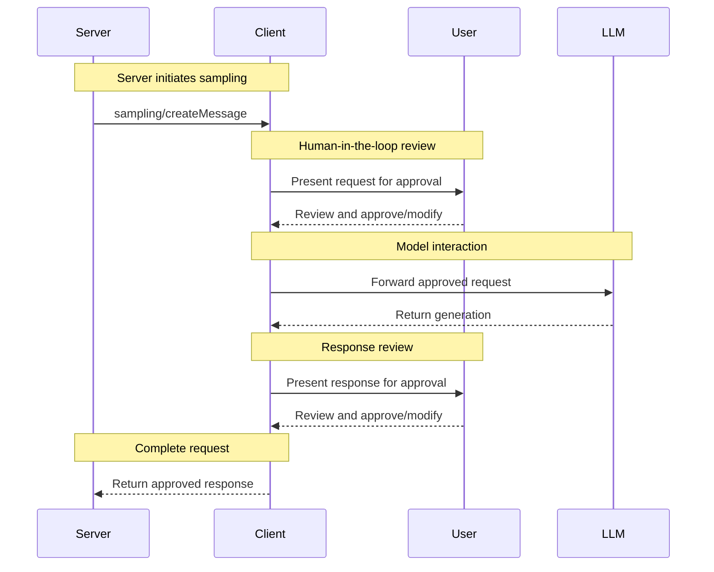

[Model Context Protocol home page](https://modelcontextprotocol.io/)

Version 2025-06-18 (latest)

Search...

⌘K

Search...

Navigation

Client Features

Sampling

[Documentation](https://modelcontextprotocol.io/docs/getting-started/intro) [Specification](https://modelcontextprotocol.io/specification/2025-06-18) [Community](https://modelcontextprotocol.io/community/communication) [About MCP](https://modelcontextprotocol.io/about)

On this page

- [User Interaction Model](https://modelcontextprotocol.io/specification/2025-06-18/client/sampling#user-interaction-model)
- [Capabilities](https://modelcontextprotocol.io/specification/2025-06-18/client/sampling#capabilities)
- [Protocol Messages](https://modelcontextprotocol.io/specification/2025-06-18/client/sampling#protocol-messages)
- [Creating Messages](https://modelcontextprotocol.io/specification/2025-06-18/client/sampling#creating-messages)
- [Message Flow](https://modelcontextprotocol.io/specification/2025-06-18/client/sampling#message-flow)
- [Data Types](https://modelcontextprotocol.io/specification/2025-06-18/client/sampling#data-types)
- [Messages](https://modelcontextprotocol.io/specification/2025-06-18/client/sampling#messages)
- [Text Content](https://modelcontextprotocol.io/specification/2025-06-18/client/sampling#text-content)
- [Image Content](https://modelcontextprotocol.io/specification/2025-06-18/client/sampling#image-content)
- [Audio Content](https://modelcontextprotocol.io/specification/2025-06-18/client/sampling#audio-content)
- [Model Preferences](https://modelcontextprotocol.io/specification/2025-06-18/client/sampling#model-preferences)
- [Capability Priorities](https://modelcontextprotocol.io/specification/2025-06-18/client/sampling#capability-priorities)
- [Model Hints](https://modelcontextprotocol.io/specification/2025-06-18/client/sampling#model-hints)
- [Error Handling](https://modelcontextprotocol.io/specification/2025-06-18/client/sampling#error-handling)
- [Security Considerations](https://modelcontextprotocol.io/specification/2025-06-18/client/sampling#security-considerations)

**Protocol Revision**: 2025-06-18

The Model Context Protocol (MCP) provides a standardized way for servers to request LLM
sampling (“completions” or “generations”) from language models via clients. This flow
allows clients to maintain control over model access, selection, and permissions while
enabling servers to leverage AI capabilities—with no server API keys necessary.
Servers can request text, audio, or image-based interactions and optionally include
context from MCP servers in their prompts.

<h2>User Interaction Model</h2>
Sampling in MCP allows servers to implement agentic behaviors, by enabling LLM calls to
occur *nested* inside other MCP server features.Implementations are free to expose sampling through any interface pattern that suits
their needs—the protocol itself does not mandate any specific user interaction
model.

<Warning>
  For trust & safety and security, there **SHOULD** always
  be a human in the loop with the ability to deny sampling requests.

  Applications **SHOULD** :

  * Provide UI that makes it easy and intuitive to review sampling requests
  * Allow users to view and edit prompts before sending
  * Present generated responses for review before delivery
</Warning>

<h2>Capabilities</h2>

Clients that support sampling **MUST** declare the `sampling` capability during
[initialization](/specification/2025-06-18/basic/lifecycle#initialization):

Copy

```
{
  "capabilities": {
    "sampling": {}
  }
}

</code>

<h2>Protocol Messages</h2>

<h3>Creating Messages</h3>

To request a language model generation, servers send a `sampling/createMessage` request:

**Request:**

```json
{
  "jsonrpc": "2.0",
  "id": 1,
  "method": "sampling/createMessage",
  "params": {
    "messages": [
      {
        "role": "user",
        "content": {
          "type": "text",
          "text": "What is the capital of France?"
        }
      }
    ],
    "modelPreferences": {
      "hints": [
        {
          "name": "claude-3-sonnet"
        }
      ],
      "intelligencePriority": 0.8,
      "speedPriority": 0.5
    },
    "systemPrompt": "You are a helpful assistant.",
    "maxTokens": 100
  }
}

</code>

**Response:**

```json
{
  "jsonrpc": "2.0",
  "id": 1,
  "result": {
    "role": "assistant",
    "content": {
      "type": "text",
      "text": "The capital of France is Paris."
    },
    "model": "claude-3-sonnet-20240307",
    "stopReason": "endTurn"
  }
}

</code>

<h2>Message Flow</h2>



<h2>Data Types</h2>

<h3>Messages</h3>

Sampling messages can contain:

<h4>Text Content</h4>

```json
{
  "type": "text",
  "text": "The message content"
}
```

<h4>Image Content</h4>

```json
{
  "type": "image",
  "data": "base64-encoded-image-data",
  "mimeType": "image/jpeg"
}
```

<h4>Audio Content</h4>

```json
{
  "type": "audio",
  "data": "base64-encoded-audio-data",
  "mimeType": "audio/wav"
}
```

<h3>Model Preferences</h3>

Model selection in MCP requires careful abstraction since servers and clients may use
different AI providers with distinct model offerings. A server cannot simply request a
specific model by name since the client may not have access to that exact model or may
prefer to use a different provider's equivalent model.

To solve this, MCP implements a preference system that combines abstract capability
priorities with optional model hints:

<h4>Capability Priorities</h4>

Servers express their needs through three normalized priority values (0-1):

* `costPriority`: How important is minimizing costs? Higher values prefer cheaper models.
* `speedPriority`: How important is low latency? Higher values prefer faster models.
* `intelligencePriority`: How important are advanced capabilities? Higher values prefer
  more capable models.

<h4>Model Hints</h4>

While priorities help select models based on characteristics, `hints` allow servers to
suggest specific models or model families:

* Hints are treated as substrings that can match model names flexibly
* Multiple hints are evaluated in order of preference
* Clients **MAY** map hints to equivalent models from different providers
* Hints are advisory—clients make final model selection

For example:

```json
{
  "hints": [
    { "name": "claude-3-sonnet" }, // Prefer Sonnet-class models
    { "name": "claude" } // Fall back to any Claude model
  ],
  "costPriority": 0.3, // Cost is less important
  "speedPriority": 0.8, // Speed is very important
  "intelligencePriority": 0.5 // Moderate capability needs
}
```

The client processes these preferences to select an appropriate model from its available
options. For instance, if the client doesn't have access to Claude models but has Gemini,
it might map the sonnet hint to `gemini-1.5-pro` based on similar capabilities.

<h2>Error Handling</h2>

Clients **SHOULD** return errors for common failure cases:

Example error:

```json
{
  "jsonrpc": "2.0",
  "id": 1,
  "error": {
    "code": -1,
    "message": "User rejected sampling request"
  }
}
```

<h2>Security Considerations</h2>

1. Clients **SHOULD** implement user approval controls
2. Both parties **SHOULD** validate message content
3. Clients **SHOULD** respect model preference hints
4. Clients **SHOULD** implement rate limiting
5. Both parties **MUST** handle sensitive data appropriately