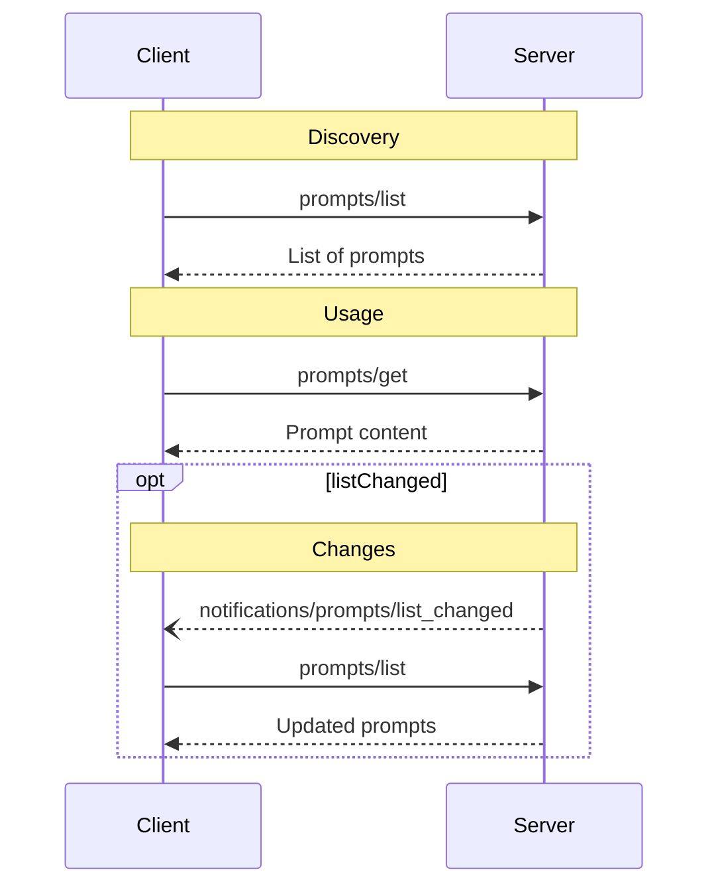

# Prompts

<div id="enable-section-numbers" />

<Info>**Protocol Revision**: 2025-06-18</Info>

The Model Context Protocol (MCP) provides a standardized way for servers to expose prompt
templates to clients. Prompts allow servers to provide structured messages and
instructions for interacting with language models. Clients can discover available
prompts, retrieve their contents, and provide arguments to customize them.

<h2>User Interaction Model</h2>
Prompts are designed to be **user-controlled**, meaning they are exposed from servers to
clients with the intention of the user being able to explicitly select them for use.

Typically, prompts would be triggered through user-initiated commands in the user
interface, which allows users to naturally discover and invoke available prompts.

For example, as slash commands:


However, implementors are free to expose prompts through any interface pattern that suits
their needs—the protocol itself does not mandate any specific user interaction
model.

<h2>Capabilities</h2>

Servers that support prompts **MUST** declare the `prompts` capability during
[initialization](/specification/2025-06-18/basic/lifecycle#initialization):

```json
{
  "capabilities": {
    "prompts": {}
  }
}
```

`listChanged` indicates whether the server will emit notifications when the list of
available prompts changes.

<h2>Protocol Messages</h2>

<h3>Listing Prompts</h3>

To retrieve available prompts, clients send a `prompts/list` request. This operation
supports [pagination](/specification/2025-06-18/server/utilities/pagination).

**Request:**

```json
{
  "jsonrpc": "2.0",
  "id": 1,
  "method": "prompts/list",
  "params": {
    "cursor": "optional-cursor-value"
  }
}
```

**Response:**

```json
{
  "jsonrpc": "2.0",
  "id": 1,
  "result": {
    "prompts": [
      {
        "name": "code_review",
        "title": "Request Code Review",
        "description": "Asks the LLM to analyze code quality and suggest improvements",
        "arguments": [
          {
            "name": "code",
            "description": "The code to review",
            "required": true
          }
        ]
      }
    ],
    "nextCursor": "next-page-cursor"
  }
}
```

<h3>Getting a Prompt</h3>

To retrieve a specific prompt, clients send a `prompts/get` request. Arguments may be
auto-completed through [the completion API](/specification/2025-06-18/server/utilities/completion).

**Request:**

```json
{
  "jsonrpc": "2.0",
  "id": 2,
  "method": "prompts/get",
  "params": {
    "name": "code_review",
    "arguments": {
      "code": "def hello():\n    print('world')"
    }
  }
}
```

**Response:**

```json
{
  "jsonrpc": "2.0",
  "id": 2,
  "result": {
    "description": "Code review prompt",
    "messages": [
      {
        "role": "user",
        "content": {
          "type": "text",
          "text": "Please review this Python code:\ndef hello():\n    print('world')"
        }
      }
    ]
  }
}
```

<h3>List Changed Notification</h3>

When the list of available prompts changes, servers that declared the `listChanged`
capability **SHOULD** send a notification:

```json
{
  "jsonrpc": "2.0",
  "method": "notifications/prompts/list_changed"
}
```

<h2>Message Flow</h2>



<h2>Data Types</h2>

<h3>Prompt</h3>

* `name`: Unique identifier for the prompt
* `title`: Optional human-readable name of the prompt for display purposes.
* `description`: Optional human-readable description
* `arguments`: Optional list of arguments for customization

<h3>PromptMessage</h3>

Messages in a prompt can contain:

* `role`: Either "user" or "assistant" to indicate the speaker
* `content`: One of the following content types:

<Note>
  All content types in prompt messages support optional
  [annotations](/specification/2025-06-18/server/resources#annotations) for
  metadata about audience, priority, and modification times.
</Note>

<h4>Text Content</h4>

```json
{
  "type": "text",
  "text": "The text content of the message"
}
```

<h4>Image Content</h4>

```json
{
  "type": "image",
  "data": "base64-encoded-image-data",
  "mimeType": "image/png"
}
```

<h4>Audio Content</h4>

```json
{
  "type": "audio",
  "data": "base64-encoded-audio-data",
  "mimeType": "audio/wav"
}
```

<h4>Embedded Resources</h4>

Embedded resources allow referencing server-side resources directly in messages:

```json
{
  "type": "resource",
  "resource": {
    "uri": "resource://example",
    "name": "example",
    "title": "My Example Resource",
    "mimeType": "text/plain",
    "text": "Resource content"
  }
}
```

Resources can contain either text or binary (blob) data and **MUST** include:

* A valid resource URI
* The appropriate MIME type
* Either text content or base64-encoded blob data

Embedded resources enable prompts to seamlessly incorporate server-managed content like
documentation, code samples, or other reference materials directly into the conversation
flow.

<h2>Error Handling</h2>

Servers **SHOULD** return standard JSON-RPC errors for common failure cases:

* Invalid prompt name: `-32602` (Invalid params)
* Missing required arguments: `-32602` (Invalid params)
* Internal errors: `-32603` (Internal error)

<h2>Implementation Considerations</h2>

1. Servers **SHOULD** validate prompt arguments before processing
2. Clients **SHOULD** handle pagination for large prompt lists
3. Both parties **SHOULD** respect capability negotiation

<h2>Security</h2>

Implementations **MUST** carefully validate all prompt inputs and outputs to prevent
injection attacks or unauthorized access to resources.