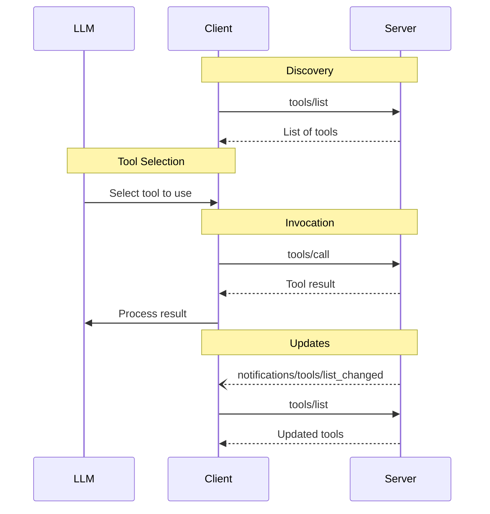

[Model Context Protocol home page](https://modelcontextprotocol.io/)

Version 2025-06-18 (latest)

Search...

⌘K

Search...

Navigation

Server Features

Tools

[Documentation](https://modelcontextprotocol.io/docs/getting-started/intro) [Specification](https://modelcontextprotocol.io/specification/2025-06-18) [Community](https://modelcontextprotocol.io/community/communication) [About MCP](https://modelcontextprotocol.io/about)

On this page

- [User Interaction Model](https://modelcontextprotocol.io/specification/2025-06-18/server/tools#user-interaction-model)
- [Capabilities](https://modelcontextprotocol.io/specification/2025-06-18/server/tools#capabilities)
- [Protocol Messages](https://modelcontextprotocol.io/specification/2025-06-18/server/tools#protocol-messages)
- [Listing Tools](https://modelcontextprotocol.io/specification/2025-06-18/server/tools#listing-tools)
- [Calling Tools](https://modelcontextprotocol.io/specification/2025-06-18/server/tools#calling-tools)
- [List Changed Notification](https://modelcontextprotocol.io/specification/2025-06-18/server/tools#list-changed-notification)
- [Message Flow](https://modelcontextprotocol.io/specification/2025-06-18/server/tools#message-flow)
- [Data Types](https://modelcontextprotocol.io/specification/2025-06-18/server/tools#data-types)
- [Tool](https://modelcontextprotocol.io/specification/2025-06-18/server/tools#tool)
- [Tool Result](https://modelcontextprotocol.io/specification/2025-06-18/server/tools#tool-result)
- [Text Content](https://modelcontextprotocol.io/specification/2025-06-18/server/tools#text-content)
- [Image Content](https://modelcontextprotocol.io/specification/2025-06-18/server/tools#image-content)
- [Audio Content](https://modelcontextprotocol.io/specification/2025-06-18/server/tools#audio-content)
- [Resource Links](https://modelcontextprotocol.io/specification/2025-06-18/server/tools#resource-links)
- [Embedded Resources](https://modelcontextprotocol.io/specification/2025-06-18/server/tools#embedded-resources)
- [Structured Content](https://modelcontextprotocol.io/specification/2025-06-18/server/tools#structured-content)
- [Output Schema](https://modelcontextprotocol.io/specification/2025-06-18/server/tools#output-schema)
- [Error Handling](https://modelcontextprotocol.io/specification/2025-06-18/server/tools#error-handling)
- [Security Considerations](https://modelcontextprotocol.io/specification/2025-06-18/server/tools#security-considerations)

**Protocol Revision**: 2025-06-18

The Model Context Protocol (MCP) allows servers to expose tools that can be invoked by
language models. Tools enable models to interact with external systems, such as querying
databases, calling APIs, or performing computations. Each tool is uniquely identified by
a name and includes metadata describing its schema.

<h2>User Interaction Model</h2>
Tools in MCP are designed to be **model-controlled**, meaning that the language model can
discover and invoke tools automatically based on its contextual understanding and the
user’s prompts.However, implementations are free to expose tools through any interface pattern that
suits their needs—the protocol itself does not mandate any specific user
interaction model.

<Warning>
  For trust & safety and security, there **SHOULD** always
  be a human in the loop with the ability to deny tool invocations.

  Applications **SHOULD** :

  * Provide UI that makes clear which tools are being exposed to the AI model
  * Insert clear visual indicators when tools are invoked
  * Present confirmation prompts to the user for operations, to ensure a human is in the
    loop
</Warning>

<h2>Capabilities</h2>

Servers that support tools **MUST** declare the `tools` capability:

Copy

```
{\n  \"capabilities\": {\n    \"tools\": {\n      \"listChanged\": true\n    }\n  }\n}\n
```

`listChanged` indicates whether the server will emit notifications when the list of
available tools changes.

<h2>Protocol Messages</h2>

<h3>Listing Tools</h3>

To discover available tools, clients send a `tools/list` request. This operation supports
[pagination](https://modelcontextprotocol.io/specification/2025-06-18/server/utilities/pagination).

**Request:**

```json
{\n  \"jsonrpc\": \"2.0\",\n  \"id\": 1,\n  \"method\": \"tools/list\",\n  \"params\": {\n    \"cursor\": \"optional-cursor-value\"\n  }\n}\n
```

**Response:**

```json
{\n  \"jsonrpc\": \"2.0\",\n  \"id\": 1,\n  \"result\": {\n    \"tools\": [\\\n      {\\\n        \"name\": \"get_weather\",\\\n        \"title\": \"Weather Information Provider\",\\\n        \"description\": \"Get current weather information for a location\",\\\n        \"inputSchema\": {\\\n          \"type\": \"object\",\\\n          \"properties\": {\\\n            \"location\": {\\\n              \"type\": \"string\",\\\n              \"description\": \"City name or zip code\"\\\n            }\\\n          },\\\n          \"required\": [\"location\"]\\\n        }\\\n      }\\\n    ],\n    \"nextCursor\": \"next-page-cursor\"\n  }\n}\n
```

<h3>Calling Tools</h3>

To invoke a tool, clients send a `tools/call` request:

**Request:**

```json
{\n  \"jsonrpc\": \"2.0\",\n  \"id\": 2,\n  \"method\": \"tools/call\",\n  \"params\": {\n    \"name\": \"get_weather\",\n    \"arguments\": {\n      \"location\": \"New York\"\n    }\n  }\n}\n
```

**Response:**

```json
{\n  \"jsonrpc\": \"2.0\",\n  \"id\": 2,\n  \"result\": {\n    \"content\": [\\\n      {\\\n        \"type\": \"text\",\\\n        \"text\": \"Current weather in New York:\\nTemperature: 72°F\\nConditions: Partly cloudy\"\\\n      }\\\n    ],\n    \"isError\": false\n  }\n}\n
```

<h3>List Changed Notification</h3>

When the list of available tools changes, servers that declared the `listChanged`
capability **SHOULD** send a notification:

Copy

```
{\n  \"jsonrpc\": \"2.0\",\n  \"method\": \"notifications/tools/list_changed\"\n}\n
```

<h2>Message Flow</h2>



<h2>Data Types</h2>

<h3>Tool</h3>

* `name`: Unique identifier for the tool
* `title`: Optional human-readable name of the tool for display purposes.
* `description`: Human-readable description of functionality
* `inputSchema`: JSON Schema defining expected parameters
* `outputSchema`: Optional JSON Schema defining expected output structure
* `annotations`: optional properties describing tool behavior

<Warning>
  For trust & safety and security, clients **MUST** consider
  tool annotations to be untrusted unless they come from trusted servers.
</Warning>

<h3>Tool Result</h3>

Tool results may contain [**structured**](https://modelcontextprotocol.io/specification/2025-06-18/server/tools#structured-content) or **unstructured** content.

**Unstructured** content is returned in the `content` field of a result, and can contain multiple content items of different types:

<Note>
  All content types (text, image, audio, resource links, and embedded resources)
  support optional
  [annotations](https://modelcontextprotocol.io/specification/2025-06-18/server/resources#annotations) that
  provide metadata about audience, priority, and modification times. This is the
  same annotation format used by resources and prompts.
</Note>

<h4>Text Content</h4>

```json
{
  "type": "text",
  "text": "Tool result text"
}
```

<h4>Image Content</h4>

```json
{
  "type": "image",
  "data": "base64-encoded-data",
  "mimeType": "image/png"
  "annotations": {
    "audience": ["user"],
    "priority": 0.9
  }

}
```

This example demonstrates the use of an optional Annotation.

<h4>Audio Content</h4>

```json
{
  "type": "audio",
  "data": "base64-encoded-audio-data",
  "mimeType": "audio/wav"
}
```

<h4>Resource Links</h4>

A tool **MAY** return links to [Resources](https://modelcontextprotocol.io/specification/2025-06-18/server/resources), to provide additional context
or data. In this case, the tool will return a URI that can be subscribed to or fetched by the client:

```json
{
  "type": "resource_link",
  "uri": "file:///project/src/main.rs",
  "name": "main.rs",
  "description": "Primary application entry point",
  "mimeType": "text/x-rust",
  "annotations": {
    "audience": ["assistant"],
    "priority": 0.9
  }
}
```

Resource links support the same [Resource annotations](https://modelcontextprotocol.io/specification/2025-06-18/server/resources#annotations) as regular resources to help clients understand how to use them.

<Info>
  Resource links returned by tools are not guaranteed to appear in the results
  of a `resources/list` request.
</Info>

<h4>Embedded Resources</h4>

[Resources](https://modelcontextprotocol.io/specification/2025-06-18/server/resources) **MAY** be embedded to provide additional context
or data using a suitable [URI scheme](https://modelcontextprotocol.io/specification/2025-06-18/server/resources#common-uri-schemes). Servers that use embedded resources **SHOULD** implement the `resources` capability:

```json
{
  "type": "resource",
  "resource": {
    "uri": "file:///project/src/main.rs",
    "title": "Project Rust Main File",
    "mimeType": "text/x-rust",
    "text": "fn main() {\n    println!(\"Hello world!\");\n}",
    "annotations": {
      "audience": ["user", "assistant"],
      "priority": 0.7,
      "lastModified": "2025-05-03T14:30:00Z"
    }
  }
}
```

Embedded resources support the same [Resource annotations](https://modelcontextprotocol.io/specification/2025-06-18/server/resources#annotations) as regular resources to help clients understand how to use them.

<h4>Structured Content</h4>

**Structured** content is returned as a JSON object in the `structuredContent` field of a result.For backwards compatibility, a tool that returns structured content SHOULD also return the serialized JSON in a TextContent block.

<h4>Output Schema</h4>

Tools may also provide an output schema for validation of structured results.
If an output schema is provided:

* Servers **MUST** provide structured results that conform to this schema.
* Clients **SHOULD** validate structured results against this schema.

Example tool with output schema:

```json
{
  "name": "get_weather_data",
  "title": "Weather Data Retriever",
  "description": "Get current weather data for a location",
  "inputSchema": {
    "type": "object",
    "properties": {
      "location": {
        "type": "string",
        "description": "City name or zip code"
      }
    },
    "required": ["location"]
  },
  "outputSchema": {
    "type": "object",
    "properties": {
      "temperature": {
        "type": "number",
        "description": "Temperature in celsius"
      },
      "conditions": {
        "type": "string",
        "description": "Weather conditions description"
      },
      "humidity": {
        "type": "number",
        "description": "Humidity percentage"
      }
    },
    "required": ["temperature", "conditions", "humidity"]
  }
}
```

Example valid response for this tool:

```json
{
  "jsonrpc": "2.0",
  "id": 5,
  "result": {
    "content": [
      {
        "type": "text",
        "text": "{\"temperature\": 22.5, \"conditions\": \"Partly cloudy\", \"humidity\": 65}"
      }
    ],
    "structuredContent": {
      "temperature": 22.5,
      "conditions": "Partly cloudy",
      "humidity": 65
    }
  }
}
```

Providing an output schema helps clients and LLMs understand and properly handle structured tool outputs by:

* Enabling strict schema validation of responses
* Providing type information for better integration with programming languages
* Guiding clients and LLMs to properly parse and utilize the returned data
* Supporting better documentation and developer experience

<h2>Error Handling</h2>

Tools use two error reporting mechanisms:

1. **Protocol Errors**: Standard JSON-RPC errors for issues like:   * Unknown tools
   * Invalid arguments
   * Server errors

2. **Tool Execution Errors**: Reported in tool results with `isError: true`:   * API failures
   * Invalid input data
   * Business logic errors

Example protocol error:

```json
{
  "jsonrpc": "2.0",
  "id": 3,
  "error": {
    "code": -32602,
    "message": "Unknown tool: invalid_tool_name"
  }
}
```

Example tool execution error:

```json
{
  "jsonrpc": "2.0",
  "id": 4,
  "result": {
    "content": [
      {
        "type": "text",
        "text": "Failed to fetch weather data: API rate limit exceeded"
      }
    ],
    "isError": true
  }
}
```

<h2>Security Considerations</h2>

1. Servers **MUST** :   * Validate all tool inputs
   * Implement proper access controls
   * Rate limit tool invocations
   * Sanitize tool outputs

2. Clients **SHOULD** :   * Prompt for user confirmation on sensitive operations
   * Show tool inputs to the user before calling the server, to avoid malicious or
     accidental data exfiltration
   * Validate tool results before passing to LLM
   * Implement timeouts for tool calls
   * Log tool usage for audit purposes