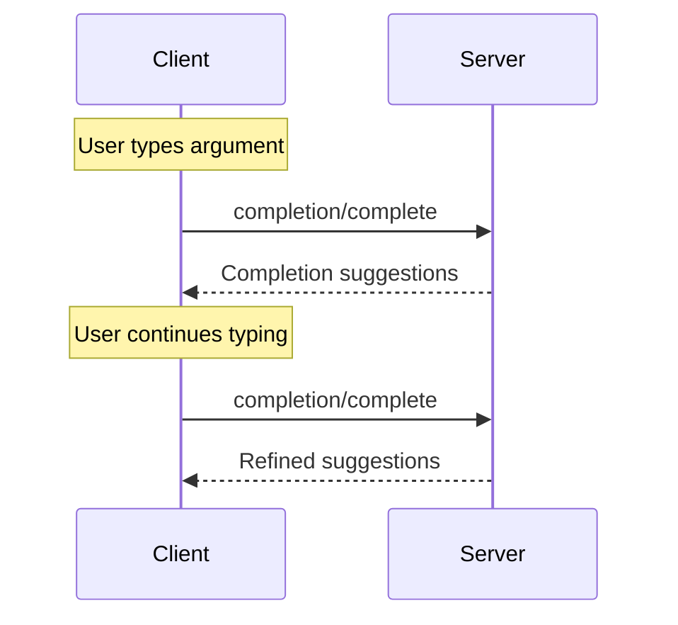

# Completion

<div id="enable-section-numbers" />

<Info>**Protocol Revision**: 2025-06-18</Info>

The Model Context Protocol (MCP) provides a standardized way for servers to offer
argument autocompletion suggestions for prompts and resource URIs. This enables rich,
IDE-like experiences where users receive contextual suggestions while entering argument
values.

<h2>User Interaction Model</h2>
Completion in MCP is designed to support interactive user experiences similar to IDE code
completion.

For example, applications may show completion suggestions in a dropdown or popup menu as
users type, with the ability to filter and select from available options.

However, implementations are free to expose completion through any interface pattern that
suits their needs—the protocol itself does not mandate any specific user
interaction model.

<h2>Capabilities</h2>

Servers that support completions **MUST** declare the `completions` capability:

```json
{
  "capabilities": {
    "completions": {}
  }
}
```

<h2>Protocol Messages</h2>

<h3>Requesting Completions</h3>

To get completion suggestions, clients send a `completion/complete` request specifying
what is being completed through a reference type:

**Request:**

```json
{
  "jsonrpc": "2.0",
  "id": 1,
  "method": "completion/complete",
  "params": {
    "ref": {
      "type": "ref/prompt",
      "name": "code_review"
    },
    "argument": {
      "name": "language",
      "value": "py"
    }
  }
}
```

**Response:**

```json
{
  "jsonrpc": "2.0",
  "id": 1,
  "result": {
    "completion": {
      "values": ["python", "pytorch", "pyside"],
      "total": 10,
      "hasMore": true
    }
  }
}
```

For prompts or URI templates with multiple arguments, clients should include previous completions in the `context.arguments` object to provide context for subsequent requests.

**Request:**

```json
{
  "jsonrpc": "2.0",
  "id": 1,
  "method": "completion/complete",
  "params": {
    "ref": {
      "type": "ref/prompt",
      "name": "code_review"
    },
    "argument": {
      "name": "framework",
      "value": "fla"
    },
    "context": {
      "arguments": {
        "language": "python"
      }
    }
  }
}
```

**Response:**

```json
{
  "jsonrpc": "2.0",
  "id": 1,
  "result": {
    "completion": {
      "values": ["flask"],
      "total": 1,
      "hasMore": false
    }
  }
}
```

<h3>Reference Types</h3>

The protocol supports two types of completion references:

| Type | Description | Example |
| --- | --- | --- |
| `ref/prompt` | References a prompt by name | `{"type": "ref/prompt", "name": "code_review"}` |
| `ref/resource` | References a resource URI | `{"type": "ref/resource", "uri": "file:///{path}"}` |

<h3>Completion Results</h3>

Servers return an array of completion values ranked by relevance, with:

* Maximum 100 items per response
* Optional total number of available matches
* Boolean indicating if additional results exist

<h2>Message Flow</h2>



<h2>Data Types</h2>

<h3>CompleteRequest</h3>

* `ref`: A `PromptReference` or `ResourceReference`
* `argument`: Object containing:
  * `name`: Argument name
  * `value`: Current value
* `context`: Object containing:
  * `arguments`: A mapping of already-resolved argument names to their values.

<h3>CompleteResult</h3>

* `completion`: Object containing:
  * `values`: Array of suggestions (max 100)
  * `total`: Optional total matches
  * `hasMore`: Additional results flag

<h2>Error Handling</h2>

Servers **SHOULD** return standard JSON-RPC errors for common failure cases:

* Method not found: `-32601` (Capability not supported)
* Invalid prompt name: `-32602` (Invalid params)
* Missing required arguments: `-32602` (Invalid params)
* Internal errors: `-32603` (Internal error)

<h2>Implementation Considerations</h2>

1. Servers **SHOULD** :   * Return suggestions sorted by relevance
   * Implement fuzzy matching where appropriate
   * Rate limit completion requests
   * Validate all inputs

2. Clients **SHOULD** :   * Debounce rapid completion requests
   * Cache completion results where appropriate
   * Handle missing or partial results gracefully

<h2>Security</h2>

Implementations **MUST** :

* Validate all completion inputs
* Implement appropriate rate limiting
* Control access to sensitive suggestions
* Prevent completion-based information disclosure